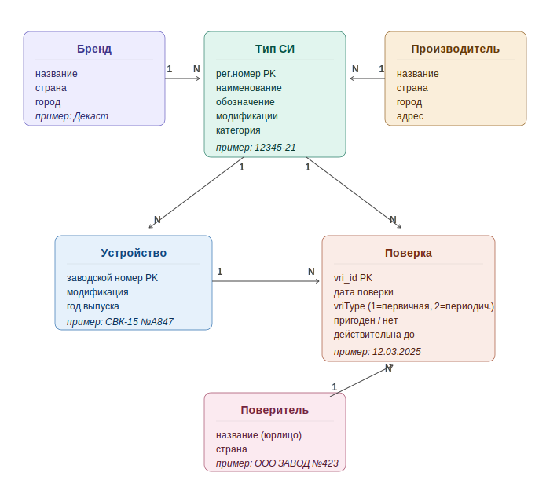

<div align="center">

# 📊 АРШИН

### Аналитика рынка водо- и теплосчётчиков на данных ФГИС Аршин

[](https://www.python.org/)
[](https://www.postgresql.org/)
[](https://datalens.yandex.ru/)
[]()

**Конкурентная аналитика по 23 брендам · Данные обновляются ежемесячно · Дашборды в DataLens**

[Предметная область](#-предметная-область) · [Термины](#-термины) · [Документация](#-документация) · [О проекте](#-о-проекте) · [Источник данных](#-источник-данных) · [Структура БД](#-структура-бд) · [Архитектура](#-архитектура) · [Запуск](#-запуск)

</div>

---

## 🧩 Предметная область

<p align="center">
  
</p>

---

## 📖 Термины

| Термин | Расшифровка |
|--------|-------------|
| **СИ** | Средство измерений — прибор для измерения физических величин (счётчик воды, теплосчётчик и т.п.) |
| **Утверждённый тип СИ** | Зарегистрированная в Росстандарте модель прибора с уникальным регистрационным номером. У одного типа СИ может быть несколько модификаций (диаметров, исполнений) |
| **Модификация СИ** | Конкретная разновидность типа СИ — обычно отличается диаметром или исполнением. Пример: тип СИ «Счётчики воды СВК», его модификации «СВК-15», «СВК-20», «СВК-40» |
| **Рег.номер типа СИ** | Уникальный номер типа СИ в реестре, формат `XXXXX-YY` (`12345-21`). По нему сшиваются все данные в проекте |
| **Поверка** | Подтверждение что прибор измеряет правильно. Бывает первичная (на заводе перед продажей) и периодическая (через несколько лет в эксплуатации) |
| **Первичная поверка** | Поверка нового прибора перед выпуском в обращение. В API обозначается `vriType = "1"`. Делается изготовителем или аккредитованной лабораторией |
| **Периодическая поверка** | Поверка прибора находящегося в эксплуатации. В API обозначается `vriType = "2"` |
| **Поверитель (организация-поверитель)** | Юрлицо, которое физически провело поверку. Может быть либо самим изготовителем, либо сторонней аккредитованной лабораторией |
| **Изготовитель** | Тот кто реально производит прибор. В реестре явно не помечается — определяем по доле первичных поверок: если у организации ≥70% поверок типа СИ — первичные, считаем её изготовителем |
| **Бренд** | Внутреннее название группы типов СИ для нашей аналитики. Не путать с изготовителем — у одного бренда могут быть разные изготовители, и наоборот |
| **ФГИС Аршин** | Федеральная государственная информационная система Росстандарта. Государственный реестр всех измерительных приборов и их поверок в РФ |
| **REST API** | Способ программного обращения к ФГИС Аршин — отправляем HTTP-запрос, получаем JSON в ответ |
| **UUID** (Universally Unique Identifier) | Уникальный идентификатор, строка вида `fee2ff47-70d8-4165-f1ee-e508987d7381` |
| **MIT** (Measuring Instrument Type) | Раздел API ФГИС Аршин — реестр **утверждённых типов СИ** (что бывает) |
| **VRI** (Verification of Instruments Registry) | Раздел API ФГИС Аршин — реестр **поверок** (что произошло) |

---

## 📚 Документация

- **Официальная документация на API ФГИС Аршин:** «Руководство пользователя компонента "Внешние публичные интерфейсы"» v.2.2, 2024 г. (PDF, 59 листов). Описание эндпоинтов, параметров, ограничений (rate-limit 2/сек, `start ≤ 99 999`)
- **Реестр ФГИС Аршин:** https://fgis.gost.ru/fundmetrology/cm/icsbase
- **API (продуктив):** `https://fgis.gost.ru/fundmetrology/eapi/`
- **API (тест):** `https://fgis.gost.ru/fundmetrologytest/eapi/`
- **Внутренние документы:** папка `docs/` репозитория

---

## 💡 О проекте

Пайплайн для автоматического сбора и анализа данных о поверках счётчиков воды и тепла из реестра [ФГИС Аршин](https://fgis.gost.ru/fundmetrology/cm/icsbase). Данные обновляются автоматически, аналитика — в DataLens.

### Зачем

| 🔄 | Данные обновляются ежемесячно — ручной сбор устаревает за неделю |
|----|---|
| 🏷️ | 23 бренда конкурентов — у каждого десятки типов СИ и сотни поверителей |
| 📈 | Динамика по месяцам — кто растёт, кто падает, где и когда |

---

## 🌐 Источник данных

REST API ФГИС Аршин. Базовый URL:

```
https://fgis.gost.ru/fundmetrology/eapi
```

Два семейства эндпоинтов:
- **MIT** — реестр утверждённых типов СИ (что зарегистрировано)
- **VRI** — реестр поверок (что произошло)

Документация: [Руководство пользователя «Внешние публичные интерфейсы» v.2.2](#-документация) от Росстандарта.

---

### 1. MIT — реестр утверждённых типов СИ

Карточки утверждённых типов СИ. По каждому типу: изготовитель, модификации, PDF-документы, межповерочные интервалы.

#### 1.1. Поиск типов СИ

```
GET /mit?search=<подстрока>&rows=<число>&start=<offset>
```

Параметры:

| Параметр | Тип | Смысл |
|----------|-----|-------|
| `search` | string | подстрока поиска. Поддерживает `*` и `?` |
| `rows` | integer | записей за запрос. Макс 100, по умолчанию 10 |
| `start` | integer | смещение пагинации. Макс 99 999, иначе `400 Bad Request` |

Возвращает `result.items[]` — используем два поля:

| Поле | Тип | Смысл |
|------|-----|-------|
| `number` | string | рег.номер типа СИ, формат `XXXXX-YY` (`12345-21`). Сквозной ключ всего пайплайна |
| `mit_uuid` | string | UUID версии записи. Ключ для запроса карточки `/mit/<uuid>` |

Остальные поля списка (`title`, `notation`, `manufacturers`) не используем — берём из карточки и из VRI.

Используется в: Шаг 0 (`dimbrand.py`), Шаг 1 (`Обновлпервич.py`).

#### 1.2. Карточка одного типа СИ

```
GET /mit/<mit_uuid>
```

Ответ — JSON со вложенной структурой. Используем:

| Путь к полю | Тип | Смысл |
|-------------|-----|-------|
| `general.notation` | массив строк | обозначение типа СИ (`["ТВТ 1001", "ТВТ 1002"]`). Пишем в `dim_reference.обозначение` через запятую |
| `manufacturer[].country` | string | страна изготовителя. Пишем в `dim_brands.страна` |
| `manufacturer[].address` | string | адрес изготовителя. Из него вытаскиваем город → `dim_brands.город` |
| PDF-документ | string | ссылка на PDF про тип СИ с перечнем модификаций. Скачиваем, парсим, заполняем `dim_reference.модификация` |

Используется в: Шаг 0 (`dimbrand.py`) — страна/город; Шаг 2 (`енрич.py`) — PDF с диаметрами.

---

### 2. VRI — реестр поверок

Реестр фактически проведённых поверок конкретных приборов. Одна запись = одна поверка одного физического счётчика.

MIT — что бывает. VRI — что произошло.

#### 2.1. Поиск поверок (список)

```
GET /vri?mit_number=<X>&year=<Y>&rows=<N>&start=<offset>
        [&org_title=...]
        [&verification_date_start=YYYY-MM-DD]
        [&verification_date_end=YYYY-MM-DD]
```

Параметры:

| Параметр | Тип | Обязат. | Смысл |
|----------|-----|---------|-------|
| `mit_number` | string | да | рег.номер типа СИ |
| `year` | integer | да | год поверок (без него — только текущий) |
| `rows` | integer | нет | макс 100 |
| `start` | integer | нет | макс 99 999 |
| `org_title` | string | нет | фильтр по поверителю |
| `verification_date_start/end` | date | нет | период, формат `YYYY-MM-DD` |

Верхний уровень ответа:

| Поле | Тип | Смысл |
|------|-----|-------|
| `result.count` | integer | общее число поверок по фильтру. Главное поле — даёт объём за месяц одним запросом, без вытягивания всех записей |
| `result.items` | массив | первая страница записей (см. ниже) |

В каждой записи `result.items[]` используем:

| Поле | Тип | Смысл |
|------|-----|-------|
| `vri_id` | string | идентификатор поверки, передаём в `GET /vri/<vri_id>` для получения `vriType` |
| `mit_number` | string | рег.номер типа СИ — связь с MIT |
| `mit_title` | string | наименование типа СИ. Пишем в `production_volumes_exact.наименование_си` |
| `mi_modification` | string | модификация поверенного экземпляра (`СВК-15`, `СВМ Ду 25`). Из неё вытаскиваем диаметр → определяем категорию |
| `org_title` | string | организация-поверитель |
| `verification_date` | date | дата поверки. Источник для разбиения объёмов по месяцам |

Остальные поля (`mit_notation`, `mi_number`, `valid_date`, `result_docnum`, `sticker_num`, `applicability`) не используем.

⚠️ В списке `/vri` поля `vriType` **нет** — доступен только в карточке `/vri/<vri_id>`.

Используется в: Шаг 1 (`Обновлпервич.py`) — выборка для пингов; Шаг 3 (`вольюмс.py`) — подсчёт объёмов.

#### 2.2. Карточка одной поверки

```
GET /vri/<vri_id>
```

Используем единственное поле:

| Путь | Тип | Смысл |
|------|-----|-------|
| `result.vriInfo.vriType` | string | тип поверки: `"1"` = первичная (на заводе), `"2"` = периодическая (в эксплуатации). Основа Шага 1: считаем долю `vriType=1` у поверителя, если ≥70% — это изготовитель |

Используется в: Шаг 1 (`Обновлпервич.py`) — функция `ping_detail`.

---

### Особенности API

| 🐛 | **HTTP 500 при фильтре по дате** — на больших объёмах. Решение: страховочная годовая выборка с распределением по месяцам |
|----|---|
| 📏 | **Лимит `start ≤ 99 999`** — у поверителей с >100k поверок весь список не вытянуть. Решение: умная выборка из 6 точек × 15 записей |
| ⏱️ | **Rate-limit 2 запроса/сек** — иначе `429`. Держим задержку `0.6 ± 0.1` сек |
| 🌍 | **TLS** — стандартный openssl Python 3.10+ не договаривается с реестром. Используем `certifi` + кастомный TLSAdapter |
| 🤔 | **Нет признака «это изготовитель»** — определяем по доле `vriType=1` |
| 🔍 | **`vriType` только в карточке** `/vri/<vri_id>` — отсюда функция `ping_detail` |
| 📅 | **Два формата дат** — запрос принимает `YYYY-MM-DD`, ответ возвращает `YYYY-MM-DDTHH:MM:SSZ` |

---

## 🗄 Структура БД

Четыре таблицы PostgreSQL. Каждый этап пайплайна пишет в свою таблицу. Повторный запуск не дублирует данные (`ON CONFLICT DO UPDATE`). Ручные правки сохраняются между прогонами.

---

### `dim_brands` — справочник брендов

Список отслеживаемых брендов. Заполняется Шагом 0 из словаря в `dimbrand.py`.

| Колонка | Тип | Описание |
|---------|-----|----------|
| `id` | SERIAL | PK |
| `бренд` | TEXT UNIQUE | внутреннее название бренда (например, `Декаст`) |
| `поиск_mit` | TEXT | подстрока для запроса `GET /mit?search=...` — то что мы реально шлём в API |
| `ключевые_слова` | TEXT | варианты написания через запятую, по которым отсеиваем шум в результатах API |
| `страна` | TEXT | страна изготовителя (из карточки MIT) |
| `город` | TEXT | город изготовителя (из карточки MIT) |

---

### `manufacturers_verifiers` — изготовители по годам

Кто реально изготавливает каждый тип СИ. Заполняется Шагом 1: для каждого типа СИ выборка из VRI → подсчёт доли `vriType=1` у каждого поверителя.

| Колонка | Тип | Описание |
|---------|-----|----------|
| `id` | SERIAL | PK |
| `reg_number` | TEXT | рег.номер типа СИ |
| `verifier` | TEXT | поверитель (`VRI.org_title`) |
| `year` | INTEGER | год |
| `primary_count` | INTEGER | число первичных поверок (`vriType=1`) в выборке |
| `periodic_count` | INTEGER | число периодических (`vriType=2`) |
| `share_pct` | REAL | доля первичных, % |
| `is_producer` | BOOLEAN | `TRUE` если `share_pct ≥ THRESHOLD` (70%) |

UNIQUE: `(reg_number, verifier, year)`. У одного типа СИ за год может быть несколько поверителей с разной оценкой.

---

### `dim_reference` — характеристики типов СИ

Модификации (диаметры), категория, признаки. Заполняется Шагом 2.

| Колонка | Тип | Описание |
|---------|-----|----------|
| `id` | SERIAL | PK |
| `рег_номер` | TEXT | рег.номер типа СИ |
| `бренд` | TEXT | бренд из `dim_brands` |
| `наименование_си` | TEXT | наименование типа СИ из `VRI.mit_title` |
| `обозначение` | TEXT | обозначение из `MIT.notation` |
| `модификация` | TEXT | список диаметров через запятую: `15, 20, 25, 40` |
| `категория` | TEXT | категория счётчика (см. ниже) |
| `тип_счетчика` | TEXT | конкретный тип (крыльчатый, турбинный, ультразвуковой и т.д.) |
| `умный` | BOOLEAN | есть ли электронный вывод |
| `мокроходный` | BOOLEAN | мокроход — для счётчиков воды |
| `многоструйный` | BOOLEAN | многоструйный — для счётчиков воды |
| `теплосчетчик` | BOOLEAN | да/нет — определяется по словам в наименовании |
| `источник` | TEXT | откуда взяли модификацию: `PDF` / `VRI` / `ручное` |
| `ручное_исправление` | TEXT | значение прописанное человеком вручную — имеет приоритет над автоматикой |

UNIQUE: `(рег_номер, категория)`. У одного типа СИ — несколько строк, по одной на категорию (например DN15+20 → «бытовые», DN25+40 → «домовые»).

Значения `категория`:
- `Счетчики воды бытовые` — DN15-DN20
- `Счетчики воды домовые` — DN25-DN40
- `Счетчики воды промышленные` — DN50+
- `Теплосчетчики`

---

### `production_volumes_exact` — объёмы поверок

Главная таблица. Объёмы по месяцам с разбивкой по категориям. Заполняется Шагом 3 (`вольюмс.py`).

| Колонка | Тип | Описание |
|---------|-----|----------|
| `id` | SERIAL | PK |
| `рег_номер` | TEXT | рег.номер типа СИ |
| `организация_поверитель` | TEXT | поверитель |
| `бренд` | TEXT | бренд (дублируем сюда для удобства в DataLens) |
| `наименование_си` | TEXT | наименование типа СИ (дублируем сюда для удобства в DataLens) |
| `год` | INTEGER | |
| `месяц` | INTEGER | 1..12 |
| `месяц_название` | TEXT | название месяца текстом — для дашборда |
| `категория` | TEXT | см. `dim_reference.категория` |
| `количество` | INTEGER | число поверок |
| `возможные_диаметры` | TEXT | все модификации через запятую — справочно |
| `updated_at` | TIMESTAMPTZ | |

UNIQUE: `(рег_номер, год, месяц, категория, организация_поверитель)` — самый детальный уровень.

---

## 🏗 Архитектура

Четыре этапа, каждый пишет в свою таблицу. Оркестратор `запук.py` управляет очерёдностью через флаги `RUN_*`.

| Шаг | Скрипт | Таблица | Что собирает |
|-----|--------|---------|--------------|
| 0 | `dimbrand.py` | `dim_brands` | 23 бренда + страна и город изготовителя |
| 1 | `Обновлпервич.py` | `manufacturers_verifiers` | Кто изготавливает тип СИ (выборка по `vriType`) |
| 2 | `енрич.py` | `dim_reference` | Модификации, категория, тип счётчика, признаки |
| 3 | `вольюмс.py` | `production_volumes_exact` | Объёмы поверок по месяцам и категориям |

Результат → Yandex DataLens.

---

## 🚀 Запуск

Полный пайплайн (раз в полгода):

```bash
python запук.py
```

Только обновление объёмов (ежемесячно) — в `запук.py` оставить только `RUN_VOLUMES = True`, `YEARS = [текущий_год]`.

Отдельные шаги:

```bash
python dimbrand.py
python Обновлпервич.py 2025 --pings 90 --positions 6 --threshold 70
python енрич.py
python вольюмс.py 2025
```

Параметры в `запук.py`:

```python
YEARS = [2023, 2024, 2025]   # годы для сбора
PINGS_TOTAL = 90              # пингов на рег.номер (Шаг 1)
SAMPLE_POSITIONS = 6          # точек выборки по списку
THRESHOLD = 70                # порог доли первичных, % → изготовитель
```

---

## 📊 Дашборд

Yandex DataLens — динамика по месяцам, топ изготовителей, доли категорий, умные счётчики, география. Фильтры: год, бренд, категория, поверитель, рег.номер.

🔗 [Открыть дашборд](https://datalens.ru/kshfsx12q6wo4-arshin)

---

## 🛠 Технический стек

```yaml
Язык:           Python 3.10+
БД:             PostgreSQL 18 (localhost)
HTTP:           requests + certifi (TLS)
Визуализация:   Yandex DataLens (CSV-подключение)
ОС:             Windows / Linux / macOS
IDE:            PyCharm
```

---

<div align="center">

**Проект АРШИН** · 2026

</div>
