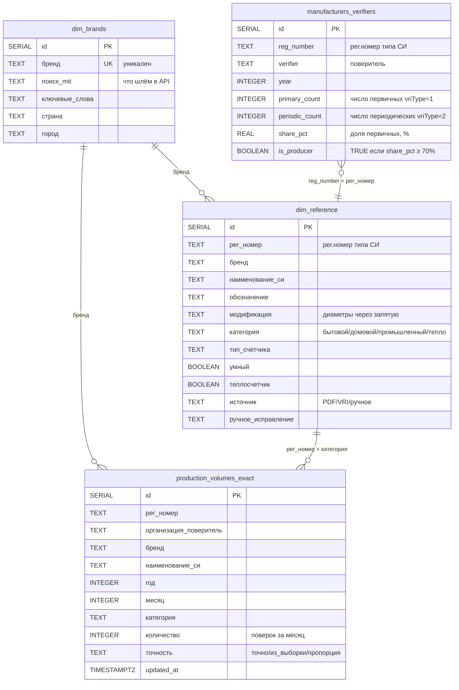

<div align="center">

# 📊 АРШИН

### Аналитика рынка водо- и теплосчётчиков на данных ФГИС Аршин

[](https://www.python.org/)
[](https://www.postgresql.org/)
[](https://datalens.yandex.ru/)
[]()

**Конкурентная аналитика по 23 брендам · Данные обновляются ежемесячно · Дашборды в DataLens**

[Термины](#-термины) · [Документация](#-документация) · [О проекте](#-о-проекте) · [Источник данных](#-источник-данных) · [Структура БД](#-структура-бд) · [Архитектура](#-архитектура) · [Запуск](#-запуск)

</div>

---

## 📖 Термины

| Термин | Расшифровка |
|--------|-------------|
| **СИ** | Средство измерений — прибор для измерения физических величин (счётчик воды, теплосчётчик и т.п.) |
| **Утверждённый тип СИ** | Зарегистрированная в Росстандарте модель прибора с уникальным регистрационным номером. У одного типа СИ может быть несколько модификаций (диаметров, исполнений) |
| **Модификация СИ** | Конкретная разновидность типа СИ — обычно отличается диаметром или исполнением. Пример: тип СИ «Счётчики воды СВК», его модификации «СВК-15», «СВК-20», «СВК-40» |
| **Рег.номер типа СИ** | Уникальный номер типа СИ в реестре, формат `XXXXX-YY` (`12345-21`). По нему сшиваются все данные в проекте |
| **Поверка** | Подтверждение что прибор измеряет правильно. Бывает первичная (на заводе перед продажей) и периодическая (через несколько лет в эксплуатации) |
| **Первичная поверка** | Поверка нового прибора перед выпуском в обращение. В API обозначается `vriType = "1"`. Делается изготовителем или аккредитованной лабораторией |
| **Периодическая поверка** | Поверка прибора находящегося в эксплуатации. В API обозначается `vriType = "2"` |
| **Поверитель (организация-поверитель)** | Юрлицо, которое физически провело поверку. Может быть либо самим изготовителем, либо сторонней аккредитованной лабораторией |
| **Изготовитель** | Тот кто реально производит прибор. В реестре явно не помечается — определяем эвристически: если у организации ≥70% поверок типа СИ — это первичные, считаем её изготовителем |
| **Бренд** | Внутреннее название группы типов СИ для нашей аналитики. Не путать с изготовителем — у одного бренда могут быть разные изготовители, и наоборот |
| **ФГИС Аршин** | Федеральная государственная информационная система Росстандарта. Государственный реестр всех измерительных приборов и их поверок в РФ |
| **REST API** | Способ программного обращения к ФГИС Аршин — отправляем HTTP-запрос, получаем JSON в ответ |
| **MIT** | Раздел API ФГИС Аршин — реестр **утверждённых типов СИ** (что бывает) |
| **VRI** | Раздел API ФГИС Аршин — реестр **поверок** (что произошло) |

---

## 📚 Документация

- **Официальная документация Росстандарта на API ФГИС Аршин:**
  «Руководство пользователя компонента "Внешние публичные интерфейсы"», версия 2.2, 2024 г. (PDF, 59 листов, идентификатор `11246589.425890.002.ИЗ.3`).
  Содержит описание всех эндпоинтов, параметров, форматов ответа, ограничений (rate-limit 2 запроса/сек, `start ≤ 99 999`).

- **Реестр ФГИС Аршин (веб-интерфейс):** https://fgis.gost.ru/fundmetrology/cm/icsbase

- **Базовый URL API (продуктивная среда):** `https://fgis.gost.ru/fundmetrology/eapi/`

- **Базовый URL API (тестовая среда):** `https://fgis.gost.ru/fundmetrology/eapi/`

- **PostgreSQL 18:** https://www.postgresql.org/docs/18/

- **Yandex DataLens:** https://yandex.cloud/ru/docs/datalens/

- **Внутренние документы проекта:** см. папку `docs/` в этом репозитории — инструкция по использованию, презентация для руководства, схемы БД и пайплайна.

---

## 💡 О проекте

**АРШИН** — это пайплайн для автоматического сбора и анализа данных о поверках счётчиков воды и тепла из государственного реестра [ФГИС Аршин](https://fgis.gost.ru/fundmetrology/cm/icsbase). Заменяет ручной Excel-справочник: данные обновляются автоматически, аналитика доступна в реальном времени через DataLens-дашборды.

### Зачем

| 🔄 | **Данные обновляются ежедневно** — ручной сбор устаревает за неделю |
|----|---|
| 🏷️ | **23 бренда конкурентов** — у каждого десятки типов СИ и сотни поверителей |
| 📈 | **Динамика по месяцам** — кто растёт, кто падает, где и когда |

### Принцип проектирования

Типы и структуры данных — первичны, алгоритмы — вторичны. Перед написанием любого скрипта мы разбираемся: какие данные нам отдаёт API, что каждое поле означает в предметной области, и какая структура хранения нам нужна. Только потом — алгоритмы и код. Иначе получаются скрипты, написанные «по ощущениям», которые потом приходится переписывать когда выясняется что половина полей значит не то, что мы думали.

Этот README отражает тот же порядок: сначала источник данных, потом структура БД, и только потом архитектура пайплайна.

---

## 🌐 Источник данных

Данные берутся из публичного REST API государственного реестра ФГИС Аршин. API описан в [Руководстве пользователя «Внешние публичные интерфейсы» v.2.2](#-документация) от Росстандарта. Базовый URL:

```
https://fgis.gost.ru/fundmetrology/eapi
```

В проекте используются два семейства эндпоинтов:
- **MIT** — реестр **утверждённых типов СИ** (что зарегистрировано в Росстандарте)
- **VRI** — реестр **поверок** (что фактически произошло с конкретными приборами)

Подробно про каждый ниже.

---

### 1. MIT — реестр утверждённых типов СИ

**MIT** хранит карточки **утверждённых типов СИ** — зарегистрированных в Росстандарте моделей измерительных приборов. По каждому типу СИ известно: кто изготовитель, какие у него модификации (например, разные диаметры), какие PDF-документы прилагаются (описание типа, методика поверки), какие межповерочные интервалы.

#### 1.1. Поиск типов СИ

Запрос:

```
GET /mit?search=<подстрока>&rows=<число>&start=<offset>
```

Параметры запроса:

| Параметр | Тип | Смысл |
|----------|-----|-------|
| `search` | string | подстрока для поиска. Например `search=Декаст` найдёт все типы СИ где «Декаст» встречается в наименовании или у изготовителя. Поддерживаются подстановочные символы `*` (любые символы) и `?` (один символ) |
| `rows` | integer | сколько записей вернуть за один запрос (максимум 100, по умолчанию 10) |
| `start` | integer | смещение для постраничной выдачи. **Жёсткий лимит API: `start ≤ 99 999`**, при превышении придёт `400 Bad Request` |
| `sort` | string | сортировка, например `sort=number+desc`. Не используем — нам не важна |

Что возвращает (`result.items[]`):

| Поле | Тип | Смысл в предметной области | Используем? |
|------|-----|---------------------------|-------------|
| `number` | string | **рег.номер типа СИ в реестре**, формат `XXXXX-YY` (например `12345-21`). Публичный идентификатор по которому весь рынок знает этот тип СИ | **Да.** Сквозной ключ всего пайплайна — по нему сшиваем тип СИ с его поверками в VRI, с его характеристиками в `dim_reference` и с объёмами в `production_volumes_exact` |
| `mit_uuid` | string | внутренний UUID версии записи в реестре. Параллельно с публичным `number` у каждой версии типа СИ есть свой UUID | **Да.** Технический ключ для запроса детальной карточки `/mit/<uuid>` |
| `title` | string | наименование типа СИ. Например `Счетчики воды крыльчатые СВК` | Из списка не читаем — берём `mit_title` из VRI и название из карточки MIT |
| `notation` | string | условное обозначение типа СИ. Например `СВК Ду 15-50` | Из списка не читаем — берём `notation` (массив) из карточки MIT |
| `manufacturers` | string | перечень изготовителей с указанием страны и населённого пункта | Из списка **не используем**. Изготовителя определяем не отсюда, а через долю первичных поверок `vriType=1` в VRI — в реестре никто явно не помечает кто текущий изготовитель |

Используется в: Шаге 0 (`dimbrand.py`), Шаге 1 (`Обновлпервич.py`) — получаем список типов СИ конкретного бренда.

#### 1.2. Карточка одного типа СИ

Запрос:

```
GET /mit/<mit_uuid>
```

Где `mit_uuid` — идентификатор версии записи, полученный из списка (1.1).

Ответ — JSON с вложенной структурой. Что используем:

| Путь к полю | Тип | Смысл в предметной области | Используем? |
|-------------|-----|---------------------------|-------------|
| `general.notation` | массив строк | условное обозначение типа СИ (`["ТВТ 1001", "ТВТ 1002"]`). У одного типа СИ может быть несколько обозначений | **Да.** Записываем в `dim_reference.обозначение` через запятую |
| `manufacturer[].country` | string | страна изготовителя (`РОССИЯ`, `Беларусь`, и т.д.) | **Да.** Записываем в `dim_brands.страна` |
| `manufacturer[].address` | string | полный адрес изготовителя | **Да, частично.** Регуляркой вытаскиваем город (паттерн `г.<город>`) и пишем в `dim_brands.город` |
| `spec[].doc_url` | string | ссылка на PDF-документ (описание типа) | **Да.** Главный источник диаметров — скачиваем PDF, парсим перечень модификаций, заполняем `dim_reference.модификация` |
| `meth[].doc_url` | string | ссылка на PDF-документ (методика поверки) | **Да, как запасной.** Если в `spec` ссылки нет — берём из `meth` |
| `general.title` | string | наименование типа СИ | В коде не читаем из карточки — берём `mit_title` из VRI |
| `general.valid_to` | date | срок действия регистрации типа СИ | Не используем. На будущее: после этой даты тип СИ снимается с производства, пригодится для фильтра «актуальные типы СИ» |
| `mpi[]` | массив | межповерочные интервалы по разным диапазонам | Не используем. На будущее: можно прогнозировать когда придёт время следующей поверки |
| `factory_num[]` | массив | заводские/серийные номера, выданные изготовителю | Не используем |

Используется в: Шаге 0 (`dimbrand.py`) — для получения страны/города; Шаге 2 (`енрич.py`) — для скачивания PDF с диаметрами.

---

### 2. VRI — реестр поверок

**VRI** — это реестр **фактически проведённых поверок** конкретных экземпляров приборов. Каждая запись = одна поверка одного физического счётчика.

Разница с MIT: MIT — это **что бывает** (тип СИ зарегистрирован, имеет такие модификации). VRI — это **что произошло** (такого-то числа такой-то экземпляр такого-то типа СИ поверила такая-то организация).

#### 2.1. Поиск поверок (список)

Запрос:

```
GET /vri?mit_number=<X>&year=<Y>&rows=<N>&start=<offset>
        [&org_title=...]
        [&verification_date_start=YYYY-MM-DD]
        [&verification_date_end=YYYY-MM-DD]
```

Параметры запроса:

| Параметр | Тип | Обязат. | Смысл |
|----------|-----|---------|-------|
| `mit_number` | string | да | рег.номер типа СИ — те самые `12345-21` из MIT |
| `year` | integer | да | год поверок. Без него API вернёт только текущий год |
| `rows` | integer | нет | сколько записей за запрос (макс 100, по умолчанию 10) |
| `start` | integer | нет | смещение пагинации. **Лимит: `start ≤ 99 999`**, превышение → `400 Bad Request` |
| `org_title` | string | нет | фильтр по конкретному поверителю |
| `verification_date_start` | date | нет | начало периода, формат `YYYY-MM-DD` |
| `verification_date_end` | date | нет | конец периода, формат `YYYY-MM-DD` |

Что возвращает на верхнем уровне:

| Поле | Тип | Смысл в предметной области | Используем? |
|------|-----|---------------------------|-------------|
| `result.count` | integer | общее число поверок удовлетворяющих фильтру | **Да, главное.** Самое ценное поле во всём API — позволяет получить точный объём поверок за месяц одним запросом, не качая 10 000 записей построчно. На нём построен весь Шаг 3 |
| `result.items` | массив | первая страница записей (см. ниже) | **Да** — для Шага 1 (выборка для пингов) и Шага 3 (подсчёт по модификациям) |
| `result.start`, `result.rows` | integer | служебная информация о текущей странице | Не используем напрямую |

Что возвращает в каждой записи (`result.items[]`):

| Поле | Тип | Смысл в предметной области | Используем? |
|------|-----|---------------------------|-------------|
| `vri_id` | string | идентификатор версии записи о поверке. Формат `2-166964556` | **Да.** Передаём в `GET /vri/<vri_id>` (карточка поверки) для получения `vriType` |
| `mit_number` | string | рег.номер типа СИ — связь с MIT | **Да.** По нему группируем поверки и сопоставляем с `dim_reference` |
| `mit_title` | string | наименование типа СИ | **Да.** Записываем в `production_volumes_exact.наименование_си`; используем для определения теплосчётчик/водосчётчик |
| `mi_modification` | string | **модификация поверенного экземпляра** — обычно содержит диаметр. Примеры: `СВК-15`, `СВМ Ду 25`, `СГВЭ-20 ALEM` | **Да.** Источник диаметра для отдельной поверки — регуляркой вытаскиваем число и относим запись к категории (бытовой/домовой/промышленный) |
| `org_title` | string | **организация-поверитель** — кто фактически провёл поверку | **Да.** Записываем в `production_volumes_exact.организация_поверитель`. Это может быть либо сам изготовитель, либо сторонняя лаборатория |
| `verification_date` | date | дата проведения поверки. Формат ISO с временем (`"2019-10-08T12:00:00Z"`) | **Да.** Источник для разбиения объёмов по месяцам |
| `mit_notation` | string | обозначение типа СИ | Не используем — `notation` берём из карточки MIT |
| `mi_number` | string | заводской/серийный номер прибора | Не используем |
| `valid_date` | date | срок действия поверки (через ~5-6 лет от `verification_date`) | Не используем. На будущее: после этой даты владелец обязан заново поверять, источник будущего спроса |
| `result_docnum` | string | номер свидетельства/извещения/выписки | Не используем |
| `sticker_num` | string | номер наклейки знака поверки | Не используем |
| `applicability` | bool | пригодность (`true` = «пригоден», `false` = «непригоден») | Не используем. На будущее: можно фильтровать только пригодные, чтобы не учитывать брак |

⚠️ **Важно:** в списке `/vri` поля `vriType` **нет**. Тип поверки (первичная/периодическая) доступен только в карточке `/vri/<vri_id>` — см. 2.2.

Используется в: Шаге 1 (`Обновлпервич.py`) — выборка из 6 точек для пингов; Шаге 3 (`вольюмс.py`) — подсчёт объёмов поверок по месяцам и категориям.

#### 2.2. Карточка одной поверки

Запрос:

```
GET /vri/<vri_id>
```

Где `vri_id` — идентификатор из списка (2.1).

Ответ — JSON со вложенной структурой. Используем единственное поле:

| Путь к полю | Тип | Смысл в предметной области | Используем? |
|-------------|-----|---------------------------|-------------|
| `result.vriInfo.vriType` | string | **тип поверки**: `"1"` = первичная (на заводе перед отгрузкой), `"2"` = периодическая (в эксплуатации) | **Да, ключевое поле.** Основа всей логики Шага 1: считаем долю `vriType=1` у каждого поверителя — если ≥ порога (70%), значит это изготовитель |

В карточке поверки доступно намного больше полей: `result.miInfo` (сведения о приборе), `result.means` (средства поверки), `result.info` (диапазоны, протокол). Эти поля не используем — для нашей аналитики нужен только `vriType`.

Используется в: Шаге 1 (`Обновлпервич.py`) — функция `ping_detail` дёргает эту карточку для каждой поверки из выборки, чтобы получить `vriType`.

---

### Особенности API и грабли

| 🐛 | **HTTP 500 при фильтре по дате** — `verification_date_start/end` нестабильно работает на больших объёмах данных, периодически отдаёт ошибку. Решение: страховочная выборка за весь год с последующим распределением по месяцам |
|----|---|
| 📏 | **Жёсткий лимит пагинации** — параметр `start ≤ 99 999`. Если у поверителя более 100 000 поверок за год — полностью пройти список нельзя, при превышении API отвечает `400 Bad Request`. Решение: умная выборка из 6 точек × 15 записей по списку |
| ⏱️ | **Rate-limit 2 запроса в секунду** — при превышении API отвечает `429 Too Many Requests`. У нас задержка `0.6 ± 0.1` сек между запросами — укладываемся в лимит |
| 🌍 | **TLS-соединение требует свежие сертификаты** — стандартный openssl у Python 3.10+ иногда не договаривается с реестром. Используем `certifi` для CA и кастомный TLSAdapter |
| 🤔 | **Нет признака «это изготовитель»** — в реестре никто специально не помечает кто изготовитель, а кто эксплуатант. Поэтому в Шаге 1 определяем эвристически по доле `vriType=1` |
| 🔍 | **`vriType` только в карточке** — в списке `/vri` этого поля нет, оно есть только в `/vri/<vri_id>` (в `result.vriInfo.vriType`). Поэтому для каждой поверки из выборки делаем отдельный запрос карточки (функция `ping_detail`) |
| 📅 | **Два формата дат** — параметры запроса принимают `YYYY-MM-DD`, ответ возвращает ISO `YYYY-MM-DDTHH:MM:SSZ`. Несовместимы, нужно конвертировать |

---

## 🗄 Структура БД

Четыре таблицы PostgreSQL. Структура спроектирована так чтобы:
- каждый этап пайплайна писал в **свою** таблицу (не было пересечений ответственности),
- все операции были **идемпотентными** (повторный запуск не дублирует данные),
- ручные правки человека **сохранялись** между прогонами автоматики.

### ER-диаграмма



Связи:
- **`dim_brands` → `dim_reference`** — по полю `бренд`. Один бренд → много типов СИ
- **`dim_brands` → `production_volumes_exact`** — по полю `бренд` (денормализация для DataLens)
- **`dim_reference` → `production_volumes_exact`** — по составному ключу `(рег_номер, категория)`. Один тип СИ → много записей объёмов (по месяцам × поверителям)
- **`manufacturers_verifiers` ↔ `dim_reference`** — по `reg_number = рег_номер`. Через эту таблицу из всех поверителей отбираем тех у кого `is_producer=true` — это и есть изготовители

---

### `dim_brands` — справочник брендов

Список брендов которые мы решили отслеживать. Заполняется Шагом 0 на основе жёстко прописанного списка из `dimbrand.py`.

| Колонка | Тип | Описание |
|---------|-----|----------|
| `id` | SERIAL | PK |
| `бренд` | TEXT UNIQUE | внутреннее название бренда (например, `Декаст`) |
| `поиск_mit` | TEXT | подстрока для запроса `GET /mit?search=...` — то что мы реально шлём в API |
| `ключевые_слова` | TEXT | варианты написания через запятую, по которым отсеиваем шум в результатах API |
| `страна` | TEXT | страна изготовителя (из карточки MIT) |
| `город` | TEXT | город изготовителя (из карточки MIT) |

---

### `manufacturers_verifiers` — изготовители по годам

Кто реально изготавливает каждый тип СИ в каждом году. Заполняется Шагом 1 — для каждого бренда находим его типы СИ через MIT, потом для каждого типа СИ смотрим VRI и определяем кто из поверителей с долей `vriType=1 ≥ 70%` — изготовитель.

| Колонка | Тип | Описание |
|---------|-----|----------|
| `id` | SERIAL | PK |
| `reg_number` | TEXT | рег.номер типа СИ — из `MIT.number` |
| `verifier` | TEXT | поверитель — из `VRI.org_title` |
| `year` | INTEGER | год — из `VRI.year` |
| `primary_count` | INTEGER | сколько первичных поверок (`vriType=1`) в выборке |
| `periodic_count` | INTEGER | сколько периодических (`vriType=2`) в выборке |
| `share_pct` | REAL | процент первичных от всех в выборке |
| `is_producer` | BOOLEAN | `TRUE` если `share_pct ≥ THRESHOLD` (70% по умолчанию) |

**Составной UNIQUE:** `(reg_number, verifier, year)` — одна и та же тройка может быть только в одной записи. То есть у одного типа СИ в одном году могут быть **несколько разных поверителей**, и для каждого своя оценка «изготовитель или нет».

---

### `dim_reference` — характеристики типов СИ

Характеристики каждого типа СИ: какие у него бывают модификации (диаметры), к какой категории он относится, теплосчётчик это или нет, и другие признаки. Заполняется Шагом 2.

| Колонка | Тип | Описание |
|---------|-----|----------|
| `id` | SERIAL | PK |
| `рег_номер` | TEXT | рег.номер типа СИ |
| `бренд` | TEXT | бренд из `dim_brands` |
| `наименование_си` | TEXT | наименование типа СИ из `VRI.mit_title` |
| `обозначение` | TEXT | обозначение из `MIT.notation` |
| `модификация` | TEXT | список диаметров через запятую: `15, 20, 25, 40` |
| `категория` | TEXT | категория счётчика (см. ниже) |
| `тип_счетчика` | TEXT | конкретный тип (крыльчатый, турбинный, ультразвуковой и т.д.) |
| `умный` | BOOLEAN | есть ли электронный вывод (M-Bus, импульсный) |
| `мокроходный` | BOOLEAN | мокроход (счётный механизм в воде) — для счётчиков воды |
| `многоструйный` | BOOLEAN | многоструйный — для счётчиков воды |
| `теплосчетчик` | BOOLEAN | да/нет — определяется по словам в наименовании |
| `источник` | TEXT | откуда взяли модификацию: `PDF` / `VRI` / `ручное` |
| `ручное_исправление` | TEXT | значение прописанное человеком вручную — имеет приоритет над автоматикой |

**Составной UNIQUE:** `(рег_номер, категория)` — у одного типа СИ может быть **несколько строк**, по одной на каждую категорию. Например тип СИ с модификациями DN15, DN20, DN25, DN40 даст две строки: одну с категорией «бытовые» (диаметры 15, 20), другую с категорией «домовые» (диаметры 25, 40).

**Возможные значения `категория`:**
- `Счетчики воды бытовые` — DN15-DN20 (квартирные)
- `Счетчики воды домовые` — DN25-DN40 (общедомовые узлы учёта)
- `Счетчики воды промышленные` — DN50+ (промышленные объекты)
- `Теплосчетчики` — отдельная категория, не делится по диаметру

---

### `production_volumes_exact` — объёмы поверок

Главная таблица — объёмы поверок по каждому типу СИ в каждом месяце, с разбивкой по категориям. Источник данных для дашборда. Заполняется Шагом 3 (`вольюмс.py`).

| Колонка | Тип | Описание |
|---------|-----|----------|
| `id` | SERIAL | PK |
| `рег_номер` | TEXT | рег.номер типа СИ |
| `организация_поверитель` | TEXT | поверитель |
| `бренд` | TEXT | бренд из `dim_brands` (денормализация для DataLens) |
| `наименование_си` | TEXT | наименование типа СИ (денормализация) |
| `год` | INTEGER | год поверок |
| `месяц` | INTEGER | месяц (1..12) |
| `месяц_название` | TEXT | название месяца текстом (Январь, Февраль…) — для дашборда |
| `категория` | TEXT | категория счётчика (см. `dim_reference.категория`) |
| `количество` | INTEGER | число поверок данной комбинации (тип СИ + поверитель + год + месяц + категория) |
| `возможные_диаметры` | TEXT | все диаметры (модификации) типа СИ через запятую — справочно |
| `точность` | TEXT | как посчитано (см. ниже) |
| `updated_at` | TIMESTAMPTZ | момент последнего обновления записи |

**Составной UNIQUE:** `(рег_номер, год, месяц, категория, организация_поверитель)` — это самый детальный уровень. Один и тот же тип СИ может встретиться в нескольких строках за один месяц если поверителей у него несколько или категорий несколько.

---

## 🏗 Архитектура

Пайплайн из четырёх этапов. Каждый этап читает результат предыдущего из БД и пишет в свою таблицу.

```
┌────────────────┐    ┌──────────────────────────┐    ┌──────────────────┐    ┌──────────────────────────┐
│  ШАГ 0         │    │  ШАГ 1                   │    │  ШАГ 2           │    │  ШАГ 3                   │
│  dimbrand.py   │ ─▶ │  Обновлпервич.py         │ ─▶ │  енрич.py        │ ─▶ │  вольюмс.py              │
│                │    │                          │    │                  │    │                          │
│  dim_brands    │    │  manufacturers_verifiers │    │  dim_reference   │    │  production_volumes_exact│
└────────────────┘    └──────────────────────────┘    └──────────────────┘    └──────────────────────────┘
        │                        │                            │                          │
        │                        │                            │                          ▼
        └────────────────────────┴────────────────────────────┴──────────────▶  📊 Yandex DataLens
                                                                                   (дашборды)
```

Сверху — оркестратор `запук.py`. Управляет очерёдностью, параметрами и флагами `RUN_*` для отдельных этапов.

### Что делает каждый этап

<table>
<tr>
<th width="120">Шаг</th>
<th width="200">Скрипт</th>
<th width="280">Таблица</th>
<th>Что собирает</th>
</tr>
<tr>
<td>🟪 <b>0</b></td>
<td><code>dimbrand.py</code></td>
<td><code>dim_brands</code></td>
<td>23 бренда + страна и город изготовителя</td>
</tr>
<tr>
<td>🟥 <b>1</b></td>
<td><code>Обновлпервич.py</code></td>
<td><code>manufacturers_verifiers</code></td>
<td>Кто реально изготавливает тип СИ (умная выборка по vriType)</td>
</tr>
<tr>
<td>🟧 <b>2</b></td>
<td><code>енрич.py</code></td>
<td><code>dim_reference</code></td>
<td>Диаметры, категория, тип счётчика, признаки</td>
</tr>
<tr>
<td>🟩 <b>3</b></td>
<td><code>вольюмс.py</code></td>
<td><code>production_volumes_exact</code></td>
<td>Объёмы по месяцам с разбивкой по категориям</td>
</tr>
</table>

---

## 🚀 Запуск

### Полный пайплайн (раз в полгода)

```bash
python запук.py
```

Запустит все этапы по очереди — от `dimbrand.py` до `вольюмс.py` для всех годов из `YEARS`.

### Только обновление объёмов (ежемесячно)

В файле `запук.py` поставить:

```python
RUN_DIMBRAND = False
RUN_PERVICH  = False
RUN_ENRICH   = False
RUN_VOLUMES  = True   # ← только этот шаг

YEARS = [2025]        # ← только текущий год
```

Дальше — `python запук.py`. Прогон будет в разы быстрее.

### Запуск отдельного шага

Любой скрипт можно запустить независимо:

```bash
python dimbrand.py
python Обновлпервич.py 2025 --pings 90 --positions 6 --threshold 70
python енрич.py
python вольюмс.py 2025
```

### Параметры в `запук.py`

```python
YEARS = [2023, 2024, 2025]   # за какие годы собирать данные

PINGS_TOTAL = 90              # пингов на рег.номер (умная выборка, шаг 1)
SAMPLE_POSITIONS = 6          # точек выборки по списку поверок
THRESHOLD = 70                # порог доли первичных, % → изготовитель
```

---

## 📊 Дашборд

Готовые данные визуализируются в Yandex DataLens:

- **Динамика по годам и месяцам** — линии по брендам
- **Топ изготовителей** — bar chart по объёму
- **Доли категорий** — пирог
- **Умные счётчики** — % с электронным выводом
- **География** — по странам и городам
- **Фильтры** — год, бренд, категория, поверитель, рег.номер

🔗 [Открыть дашборд](https://datalens.ru/kshfsx12q6wo4-arshin)

---

## 🛠 Технический стек

```yaml
Язык:           Python 3.10+
БД:             PostgreSQL 18 (localhost)
HTTP:           requests + certifi (TLS)
Визуализация:   Yandex DataLens (CSV-подключение)
ОС:             Windows / Linux / macOS
IDE:            PyCharm
```

---

<div align="center">

**Проект АРШИН** · 2026

</div>
